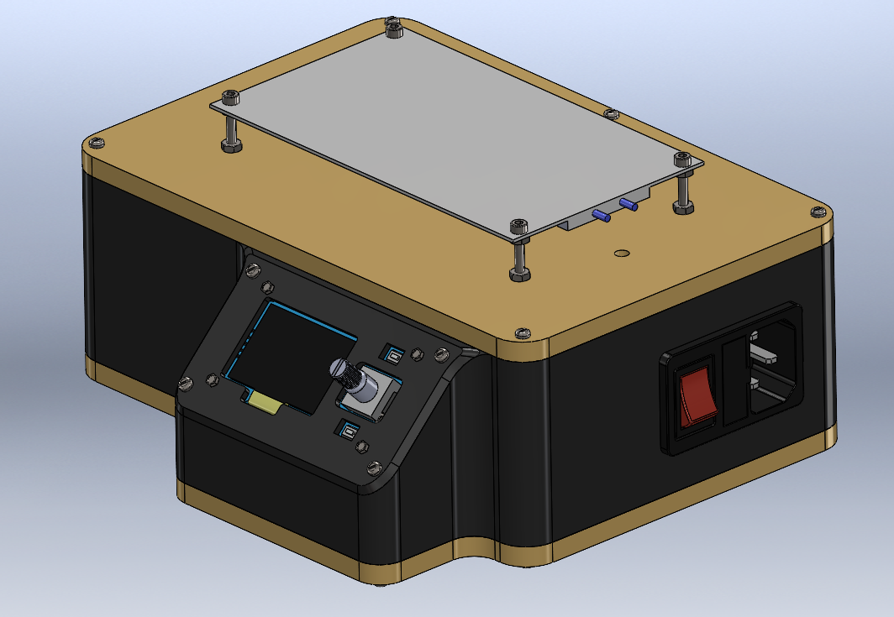
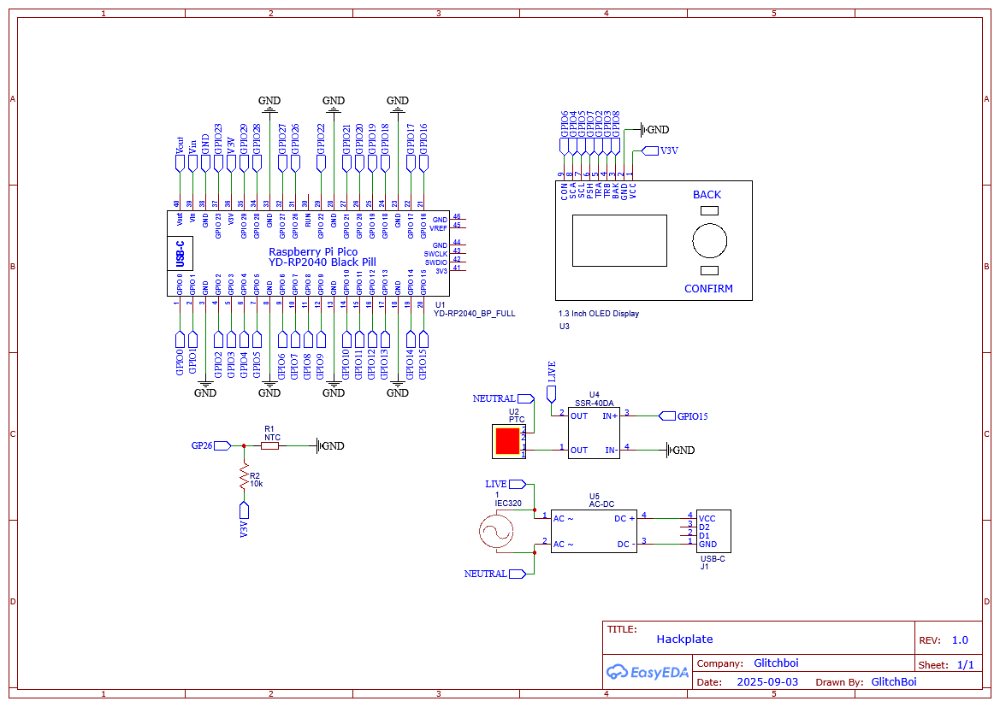

# HackPlate – Open Reflow Station



<p align="center">
  <strong>Desarrollado por Glitchboi</strong><br>
  Seguridad desde México para todos
</p>


---

## Descripción

HackPlate es una estación de precalentado **opensource y DIY** diseñada con microcontroladores y electrónica accesible. Su objetivo es ofrecer una alternativa confiable y económica para quienes trabajan en soldadura, reparación de PCBs y proyectos de hardware.  
Nace de la necesidad de tener un equipo seguro, hackeable y transparente frente a estaciones comerciales costosas.  
Queremos que cualquier persona pueda aprender, experimentar y modificar el sistema sin depender de software propietario, promoviendo la cultura maker y hacker.

---

## Tabla de Contenidos

- [Instalación](#-instalación)
- [Uso](#-uso)
- [Contribuir](#-contribuir)
- [Créditos](#-créditos)

---

## Instalación

### Prerrequisitos
- **Hardware**: 
	- [Raspberry Pi Pico (RP2040) o compatible](https://es.aliexpress.com/item/1005003371056277.html)
	- [Módulo SSR de 40A](https://es.aliexpress.com/item/1005006842797843.html)
	- [Pantalla OLED 1.3" (SSD1306 o SH1106)](https://es.aliexpress.com/item/1005009224365346.html)
	- Encoder rotatorio
	- Botones de control
    - Resistencia 10k
	- [Sensor NTC 100k](https://es.aliexpress.com/item/1005006800656219.html)
	- [Módulo AC-DC 5V](https://es.aliexpress.com/item/4000820639467.html) 
	- [Tomacorriente con interruptor y fusible](https://es.aliexpress.com/item/1005007562089190.html)
	- [Placa PTC](https://es.aliexpress.com/item/1005009178127210.html)
- **Software**:  
  - [MicroPython](https://micropython.org/download/) cargado en la Pico.  
  - Driver `ssd1306.py` o `sh1106.py` según tu pantalla.  
  - Herramientas para subir archivos (`rshell`, `ampy` o [Thonny](https://thonny.org/)).  

### Pasos
1. Conecta los diferentes componentes: 



| Componente                     | Señal        | Pin Pico (GPIO) | Notas                             |
| ------------------------------ | ------------ | --------------- | --------------------------------- |
| **OLED 1.3" (SSD1306/SH1106)** | SDA          | GP4             | I2C0 SDA                          |
|                                | SCL          | GP5             | I2C0 SCL                          |
| **Encoder rotatorio**          | A            | GP2             | Señal A (IRQ)                     |
|                                | B            | GP3             | Señal B (IRQ)                     |
|                                | Push (PSH)   | GP7             | Botón integrado del encoder       |
| **Botones adicionales**        | OK (CON)     | GP6             | Botón de confirmación             |
|                                | Back (BAK)   | GP8             | Botón de retroceso                |
| **Sensor NTC 100k**            | Nodo divisor | ADC0 (GP26)     | Pull-up 10k a 3V3, NTC a GND      |
| **SSR 40DA**                   | Control IN+  | GP15            | Activa la salida AC al calentador |
|                                | Control IN–  | GND             | Tierra compartida con la Pico     |
| **LED de estado**              | Estado       | GP25            | LED interno de la Pico            |
| **Alimentación**               | VCC          | 5V (Vsys)       | Desde el módulo AC-DC 5V          |
|                                | 3V3          | 3V3 OUT         | Rail interno usado para NTC       |
|                                | GND          | GND             | Referencia común                  |

2. Carga el firmware
``` bash
git clone https://github.com/Glitchboi-sudo/HackPlate
cd hotplate/software
# Copia los archivos main.py y drivers a la Pico

```

---

## Uso

El firmware ofrece un **menú simple y textual** para:
1. Editar la temperatura de trabajo.    
2. Iniciar el calentamiento de la superficie con animación de flama y control por histéresis.
3. Ejecutar un self-test que valida NTC, encoder, botones, SSR y pantalla.    
Durante el funcionamiento, el **LED interno de la Pico** refleja el estado del sistema (OK, error, edición, arranque). El control se realiza con el encoder y botones, mientras que la OLED muestra menús y estados en tiempo real.

---

## Contribuir

Este proyecto no solo es un repositorio: es un espacio abierto para aprender, experimentar y construir juntos. **Buscamos activamente contribuciones**, ya sea en la parte técnica o incluso en la documentación.
- **En hardware:** Si detectas oportunidades para mejorar la eficiencia (por ejemplo, usando otros chips, optimizando el consumo de energía o cambiando componentes por alternativas más confiables), ¡tus sugerencias son bienvenidas!    
- **En software:** Desde corrección de bugs, optimización de rendimiento, hasta mejoras en la legibilidad del código o documentación; todo aporte, grande o pequeño, suma muchísimo.
No necesitas ser experto para ayudar: si crees que algo puede explicarse mejor, que el código puede ser más claro, o que hay una forma más elegante de hacer algo, **cuéntanos o abre un Pull Request**.

---

## Créditos

- Proyecto hecho con [Driver SSH1106](https://github.com/robert-hh/SH1106) hecho por *[robert-hh](https://github.com/robert-hh)*
- Proyecto hecho con [Modelo 3D](https://www.fiverr.com/eloymar7/do-professional-3d-modeling-for-prototypes-and-3d-printing?source=order_page_summary_gig_link_title&funnel=fe285351ef8a4b7fa714e0b6bbeb7de4#) hecho por *[Eloy G](https://www.fiverr.com/eloymar7?source=gig_page)* 
- Modificado / Creado por:
    - [Erik Alcántara Covarrubias](https://www.linkedin.com/in/erik-alc%C3%A1ntara-covarrubias-29a97628a/)